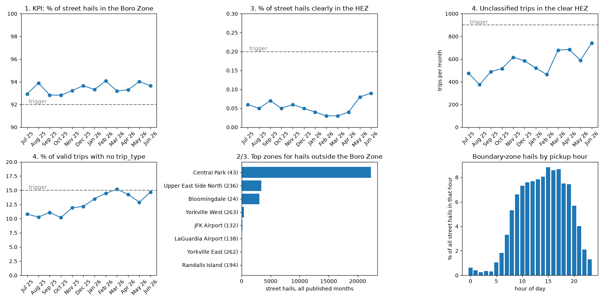
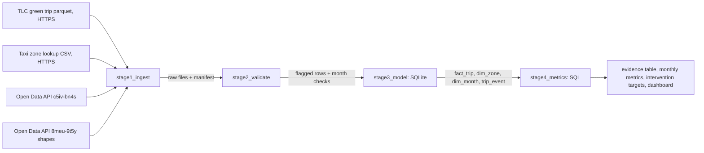

# Green taxis: are they serving the areas they were created for?

FDE Data Foundations Assignment (Classes 4 to 8), Track B: NYC TLC.

The client is hypothetical: I play the FDE for TLC's green taxi program team. The data is real and public:
TLC green trip records (July 2025 to June 2026), the TLC taxi zone lookup, and two TLC datasets on NYC Open Data.

## 1. What the assignment asked

Take a real operational problem from messy source data to a small pipeline that produces metrics people can
trust. For Track B: use NYC taxi data to build a workflow view of trips, validate duration and location data,
define 3 to 5 operational metrics and automate a repeatable monthly pipeline. The repo needs a README, a source
map, a workflow/data model diagram, code and notebooks, a runnable pipeline, an evidence table with a
Known / Unknown / Assumption / Limitation section, and a short demo of one judgement call.

## 2. The problem

Green taxis (Boro Taxis) may only take street hails outside the Hail Exclusionary Zone. TLC's green cab page
says they "may not operate in the Hail Exclusionary Zone, south of West 110th St and East 96th St", and the
airports are in that zone too. Dispatched trips are allowed anywhere.

Before choosing a metric I looked at the raw data: about 6.6% of street hails are coded to a Yellow Zone zone or
an airport, and about one trip in eight has no hail/dispatch flag at all. So the question became: how much
street-hail service happens where it is supposed to, where is the rest, and is the data good enough to act on?

**Users and stakeholders** (roles I assumed, I didn't interview anyone):

| Role | What they need |
|---|---|
| Green taxi program team (main user) | one monthly number for "is the program serving its area" |
| TLC enforcement / field staff | which zones and hours to check first, and how sure the data is |
| Driver and base outreach | where drivers take hails near or inside the line |
| TLC vendor data team | the data problems: missing trip_type, the May 2026 gap, an undocumented column |

**Project KPI: Boro Zone share of street hails** = valid street hails (trip_type = 1) picked up in a Boro Zone
zone / valid street hails with a known pickup zone. Higher is better. Dispatch trips are allowed anywhere, so
only street hails count.

**Decision it supports:** where TLC should look first (zones and hours) and which data gaps to raise with the
vendors before anyone uses this for enforcement.

## 3. Sources and retrieval

Full source map (business question, information, owner, grain, gaps): [docs/source_map.md](docs/source_map.md).

| Source | Owner | Grain | Retrieval mode |
|---|---|---|---|
| Green trip records, `green_tripdata_YYYY-MM.parquet` | TLC (submitted by technology vendors) | one row per trip | file over HTTPS |
| Taxi zone lookup CSV | TLC | one row per zone (265) | file over HTTPS |
| Pickups by Taxi Zone and Industry (`c5iv-bn4s`) | TLC on NYC Open Data | month x industry x zone | SODA API (JSON) |
| NYC Taxi Zones shapes (`8meu-9t5y`) | TLC on NYC Open Data | one shape per zone | SODA API (GeoJSON) |

Two retrieval modes: files over HTTPS and the SODA API. SQLite SQL is used after that for the model and metrics.
The trip files are the only source with pickup zone and hail/dispatch per trip, so the KPI comes from them. I
used the zone shapes to find the six Yellow Zone zones that touch the Boro Zone, and TLC's own monthly pickup
counts from the API as an independent completeness check. Main gaps: no GPS point (only zone), 12.48% of raw rows
have no trip_type, and the dictionary says trip_type "can be altered by the driver".

How I know retrieval is complete (`scripts/stage1_ingest.py`):

- A HEAD request checks every month exists before anything is downloaded.
- Each file goes to a `.part` file, its size is checked against Content-Length, then it is renamed. Size,
  sha256 and parquet footer rows go into the manifest ([outputs/raw_manifest.json](outputs/raw_manifest.json)).
- The API is asked for `count(*)` first, then paged, and the rows must add up. Pages are saved as received.
- Result: 12 of 12 months, 543,143 rows read = footer rows. File rows match TLC's published pickups within
  0.15% in eleven months. May 2026 is 2.08% short because vendor 6 has no trips after May 26 in that file.
- Raw files are never edited.

## 4. Validation

Profiling is in [notebook 1](notebooks/01_sources_retrieval_profiling.ipynb). The 13 rules are in `scripts/rules.py`,
with reason, severity, action and counts in [docs/validation_rules.md](docs/validation_rules.md). FAIL rows are
flagged and excluded, never deleted. WARN rows stay in but are left out of one metric. INFO is only counted.

What mattered most:

- 1,549 negative totals (FAIL). 1,526 have a positive twin with the same vendor, times and zones, so they are
  fare reversals and would count trips twice.
- 205 pickups outside the file month (FAIL), 4 of them dated 2008/2009.
- 2,279 trips over 3 hours, most about 23 hours with a normal distance, so the meter was left on (WARN).
- 1,773 trips with unknown pickup zone 264/265 (WARN, out of the KPI denominator).
- 67,796 raw rows with no trip_type (INFO). I didn't guess them; they are metric 4.

Result: 541,384 valid trips and 1,759 excluded rows (0.32%). Raw = valid + excluded for every month.

## 5. Workflow model and metrics

Workflow: request (hail or dispatch) -> pickup -> dropoff -> payment -> vendor record -> TLC file. The rule
applies at pickup, so each trip's outcome is the class of its pickup zone: `boro_zone`, `boundary`, `clear_hez`
(rest of the Yellow Zone plus airports) or `unknown`.

`scripts/stage3_model.py` builds a small SQLite star schema at trip grain: `fact_trip` joined to `dim_zone`
(pickup and dropoff) and `dim_month`, plus `trip_flag`, `validation_rule` and `api_zone_pickups`. TLC has no
event records, so the view `trip_event` builds pickup, dropoff and fare_reversal events from the timestamps.
Diagrams: [docs/workflow_and_data_model.md](docs/workflow_and_data_model.md).

`scripts/stage4_metrics.py` computes 5 metrics with SQL joins and aggregations. Formulas, KPI links and why
each trigger level was chosen: [docs/metric_definitions.md](docs/metric_definitions.md).

1. KPI: Boro Zone share of street hails.
2. Boundary-zone share of street hails.
3. Clear exclusionary-zone (or airport) share of street hails. Metrics 1 + 2 + 3 = 100%.
4. Unclassified trips (no trip_type), and how many start clearly inside the exclusionary zone.
5. Share of raw rows excluded by FAIL rules.

## 6. Pipeline dependability

`python run_all.py` runs `stage1_ingest.py`, `stage2_validate.py`, `stage3_model.py` and `stage4_metrics.py`
in order. Real runs are in [outputs/sample_run_log.txt](outputs/sample_run_log.txt).

- Logging: every stage logs to the console and `logs/pipeline.log` with counts and checks per month.
- Checks between stages: rows read = footer rows, raw = valid + excluded, 100% of trips join to a zone, every
  vendor reports to the end of the month, and file volume within 1% of TLC's API count.
- Rerun: files that match the manifest checksum (and the server size) are skipped. If TLC re-posts a month
  with a new size it is downloaded again. If TLC can't be reached but every file is on disk, it runs offline.
  Stage 4 logs whether `monthly_metrics.csv` changed; my second run said "identical to the previous run".
- Failures: 3 attempts with 2 s and 4 s waits. A missing month stops the run with exit 1 before downloading.
  A corrupted file fails its checksum and is downloaded again. A month over the FAIL limit is HELD: metrics
  blank, exit code 2. The database is built in a `.part` file and swapped in only when complete.

## 7. Setup and run

Python 3.12 and internet access. The first run downloads about 17 MB and takes about a minute.

```bash
python3.12 -m venv .venv
source .venv/bin/activate
pip install -r requirements.txt

python run_all.py --start 2025-07 --end 2026-06   # full pipeline, writes outputs/
python run_all.py --start 2025-07 --end 2026-06   # rerun: downloads skipped, metrics identical
python -m pytest -q tests                          # 14 tests

cd notebooks    # run the pipeline first, the notebooks read data/raw and data/processed
jupyter nbconvert --to notebook --execute --inplace 01_sources_retrieval_profiling.ipynb
jupyter nbconvert --to notebook --execute --inplace 02_validation_model_metrics.ipynb
```

Options: `--refresh-api` re-fetches the API pages, `--max-fail-share` changes the hold limit (default 0.02).
Exit codes: 0 = all months published, 1 = a stage failed, 2 = at least one month held.

```
run_all.py            runs the 4 stages
scripts/              common.py, rules.py, stage1_ingest.py ... stage4_metrics.py
notebooks/            01 sources, retrieval, profiling / 02 validation, model, metrics
docs/                 source_map, workflow_and_data_model, validation_rules, metric_definitions
outputs/              evidence_table.md, monthly_metrics.csv, intervention_targets.csv, dashboard.png, ...
tests/test_rules.py
data/, logs/          made by the pipeline, not committed
```

## 8. Final results

Pooled over 12 months (all published). Monthly values and the top intervention targets are in
[outputs/evidence_table.md](outputs/evidence_table.md).

| # | Metric | 2025-07 | 2026-06 | Pooled | Decision trigger (per month) |
|---|---|---|---|---|---|
| 1 (KPI) | Street hails picked up in the Boro Zone | 92.94% | 93.65% | 93.39% | below 92%: review intervention targets |
| 2 | Street hails in a boundary Yellow Zone | 7.00% | 6.26% | 6.56% (29,222) | none, used to rank zones and hours |
| 3 | Street hails clearly inside the exclusionary zone or at an airport | 0.06% | 0.09% | 0.05% (239) | above 0.2%: field check |
| 4 | Valid trips with no trip_type (in clear HEZ) | 10.79% (477) | 14.69% (743) | 12.52% (6,741) | above 15% or 900: raise with vendors |
| 5 | Raw rows excluded by FAIL rules | 0.30% | 0.28% | 0.32% | above 2%: month held |



What I found:

- The KPI stayed between 92.81% and 94.08% every month, never near the 92% trigger.
- Almost all of the rest is on the boundary. Central Park alone has 22,278 of the 29,222 boundary hails, and
  its 3 pm to 7 pm band is 33.1% of all hails outside the Boro Zone. Only 239 hails in the year were clearly
  inside the zone, 205 of them at JFK and LaGuardia.
- The biggest blind spot is unclassified trips: 6,741 start clearly inside the zone (28 times the 239 clear
  hails), and 6,681 of those are from vendor 6. Their share rose from 10.79% to 14.69% and passed 15% in March 2026.

What I would tell the program team:

1. Get vendor 6 to report trip_type and ask what the new `request_source = "A"` column means. Until then the
   KPI can't see one trip in eight. Also ask why the May 2026 file stops on May 26.
2. Don't treat the 6.56% boundary share as violations. If TLC wants to check, start with Central Park 3 pm to
   7 pm (about 187 hails a week), then Upper East Side North and Bloomingdale (`intervention_targets.csv`).
3. Before any enforcement, ask the vendors for pickup coordinates in the six boundary zones.
4. Keep the monthly run. The KPI and clear-HEZ triggers haven't fired.

## 9. The judgement call

About 6.6% of street hails are coded outside the Boro Zone, and it would be easy to call those violations. I
didn't. 99.19% of them are in the six zones along the 96th/110th St line. A zone can't tell a legal pickup on
110th St from an illegal one on 100th St, so I split them into boundary (6.56%) and clear (0.05%) and call both
"potential" exclusionary-zone pickups.

## 10. Known / Unknown / Assumption / Limitation

**Known:**
- 543,143 raw rows, 541,384 valid trips; KPI 93.39% pooled.
- 239 street hails clearly inside the zone (JFK 116, LaGuardia 89).
- All 47,951 vendor 6 rows have no trip_type; 6,741 unclassified trips start clearly inside the zone.
- The May 2026 file has no vendor 6 trips after May 26 and is 2.08% below TLC's count.
- June 2026 has a `request_source` column that isn't in the data dictionary.

**Unknown:**
- Where inside a boundary zone each pickup was (no GPS).
- Whether trip_type = 1 is always right, since drivers can change it.
- Whether vendor 6 trips are hails or dispatches, and what `request_source = "A"` means.
- Whether TLC will re-post May 2026 (not re-posted as of 2026-09-25).

**Assumptions:**
- The lookup's `service_zone` matches the rule (Boro Zone allowed, Yellow Zone and airports not).
- A zone touching a Boro Zone polygon (within about 50 m) counts as a boundary zone.
- A trip belongs to the month of its file.
- The trigger levels are my own, set from these 12 months.

**Limitations:**
- Zone-level data can't prove a violation.
- The KPI doesn't cover 12.52% of valid trips.
- The API cross-check is TLC data from the same submissions, so it checks completeness, not correctness.
- 12 months is too short for seasonality, and the thresholds (3 hours, 80 mph, 2%) are my choices.

## 11. Source map and diagram

Full versions: [docs/source_map.md](docs/source_map.md) and
[docs/workflow_and_data_model.md](docs/workflow_and_data_model.md).


