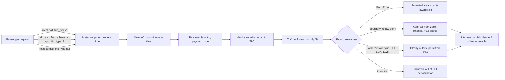
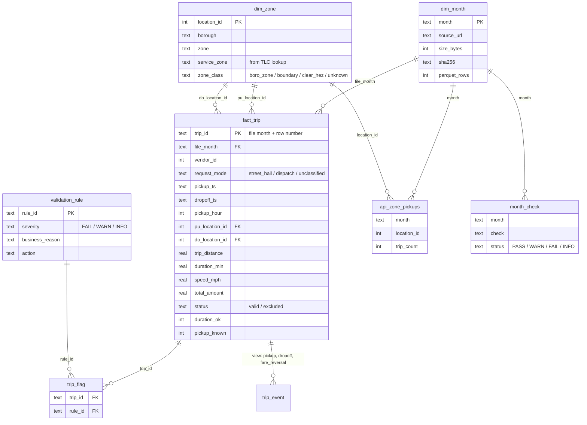

# Workflow and data model

## The business workflow

One green taxi trip goes through these steps. The program's rule applies at step 2 (where the pickup
happens), so that is where the KPI is measured.



Plain-text version:

```
request (hail / dispatch / unknown)
   -> pickup (meter on, zone, time)          <- the rule applies here
   -> dropoff (meter off, zone, time)
   -> payment (fare, total, payment_type)    <- reversals show up here as negative totals
   -> vendor record -> TLC monthly file
   -> outcome: boro_zone | boundary | clear_hez | unknown
   -> intervention (TLC): where to send field checks or outreach
```

Entities: trip, taxi zone, service zone, month (file), vendor.
Events/states: request mode, pickup, dropoff, payment, fare reversal, record status (valid / excluded).
Intervention: TLC enforcement or driver outreach, aimed at zone x hour bands (`outputs/intervention_targets.csv`).
Outcome: the pickup's zone class, rolled up into the monthly KPI.

The grain of the source and of my model is the trip record. TLC does not publish separate event records,
so the events come from the timestamps on each trip. The SQLite view `trip_event` turns them into rows:

| event | from | count |
|---|---|---|
| pickup | `pickup_ts`, `pu_location_id` | 543,143 (541,384 valid) |
| dropoff | `dropoff_ts`, `do_location_id` | 543,143 (541,384 valid) |
| fare_reversal | rows with rule F03 (negative total), at `dropoff_ts` | 1,549 |

## The relational model (SQLite, `data/processed/green_taxi.db`)



Plain-text version:

```
dim_month (1) ---< fact_trip >--- (1) dim_zone   [joined twice: pickup and dropoff]
                      |
                      +---< trip_flag >--- validation_rule
dim_month (1) ---< api_zone_pickups >--- dim_zone
dim_month (1) ---< month_check
fact_trip (1) ---< trip_event (view, 2 or 3 events per trip)
```

Notes on the choices:

- `fact_trip` keeps every raw row, including excluded ones, so `raw rows = valid + excluded` can be checked
  in SQL for every month.
- `zone_class` is a column I added. It isn't in TLC's lookup, and it adds one thing the lookup does not have: the six Yellow Zone zones
  whose shapes touch a Boro Zone zone (24, 43, 194, 236, 262, 263) are `boundary`.
- `trip_id` is built from the file month and row position, so it is the same on every rerun of the same file.
